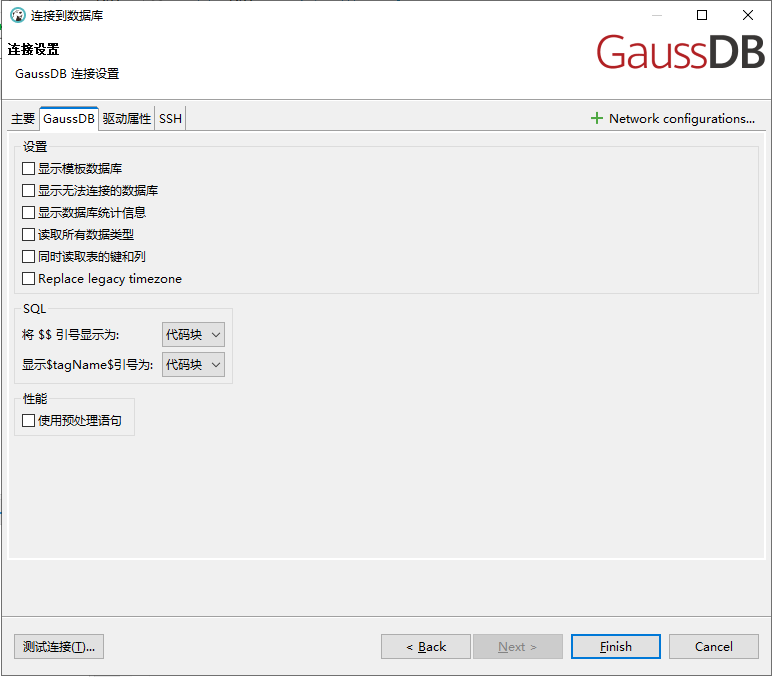

# DBeaver GaussDB使用指南

## 1 概述
本指南提供了有关如何在 DBeaver 中设置和使用 GaussDB 的说明。

DBeaver 对 GaussDB 提供了广泛的支持，但可能无法涵盖所有可能的功能。如果 DBeaver 缺少您需要的某项功能，请通过我们的 [GitHub 页面](https://github.com/dbeaver/dbeaver/issues/new/choose) 提交请求。如果您是一名开发人员，您可以选择通过贡献自己的代码来增强 DBeaver 的功能。有关如何进行此操作的指南，请查看我们的《[贡献指南](https://dbeaver.com/docs/dbeaver/Contribute-your-code/)》。在开始之前，您必须在 DBeaver 中创建一个连接并选择 GaussDB。如果您尚未进行此操作，请参考我们的《[数据库连接](https://dbeaver.com/docs/dbeaver/Create-Connection/)》文章。

DBeaver 使用特定的驱动程序与 GaussDB 服务器进行交互，您必须在 “连接到数据库” 窗口中选择合适的驱动程序。

## 2 环境准备
本小节简单概述了启动本系统前基本的环境配置说明。

### 2.1 GaussDB数据库环境配置
本系统运行使用集中式数据库，版本为：gaussdb (GaussDB Kernel 505.2.1 build ff07bff6)。
开发人员可以使用SELECT VERSION()查询版本信息。

### 2.2 DBeaver开发环境准备

#### 2.2.1在IDEA中部署开发环境
本系统在IDEA中部署的步骤可以参考DBeaver官网提供的流程，此处补充说明部分内容作参考。
- [在IDEA中部署](https://github.com/dbeaver/dbeaver/wiki/Develop-in-IDEA)

补充说明：
考虑到github本身以及其他相关因素等可能会导致的丢包、传输失败等问题，若按照流程操作后无法正常运行本系统，请重复步骤9、10。若仍然无法正常运行，请及时联系项目相关技术人员寻求帮助。

#### 2.2.2在Eclipse中部署开发环境
本系统在Eclipse中部署的步骤可以参考DBeaver官网提供的流程。
- [在Eclipse中部署](https://github.com/dbeaver/dbeaver/wiki/Develop-in-Eclipse)

## 3 设置
本节概述了 DBeaver 用于建立直接连接的设置，以及使用 SSH、Proxy 配置安全连接的方法，同时还介绍了针对 GaussDB 的 JDBC 驱动程序的设置。

### 3.1 GaussDB 连接设置
在本小节中，我们将概述使用 DBeaver 建立与 GaussDB 数据库的直接连接的设置。正确配置连接可确保 DBeaver 与您的 GaussDB 数据库之间实现无缝交互。

1. 连接设置的第一页要求您填写特定字段，以建立初始连接。

| 字段 | 描述 |
| --- | --- |
| **连接方式（主机/URL）** | 选择是通过主机还是 URL 进行连接。 |
| **URL** | 如果您通过 URL 进行连接，请在此处输入您的 GaussDB 数据库的 URL。如果您通过主机进行连接，此选项将隐藏。 |
| **主机** | 如果您通过主机进行连接，请在此处输入您的 GaussDB 数据库的主机地址。 |
| **数据库** | 输入您要连接的 GaussDB 数据库的名称。 |
| **端口** | 输入您的 GaussDB 数据库的端口号。GaussDB 的默认端口是 `8000`。 |
| **认证方式** | 选择您要用于此连接的认证类型。有关认证类型的详细指南，请参考以下文章： - [Database Native 认证](https://dbeaver.com/docs/dbeaver/Authentication-Database-Native/) - [PostgreSQL PgPass 认证](https://dbeaver.com/docs/dbeaver/Authentication-PostgreSQL-Pgpass/) |
| **连接详情** | 如有必要，提供额外的 [连接详情](#311-连接详情)。 |
| **驱动名称** | 此字段将根据您选择的驱动类型自动填充。 |
| **驱动设置** | 如果有任何 [特定的驱动设置](#32-驱动程序属性)，请在此处进行配置。 | 

2. 连接设置的第二页提供了额外的选项，可让你进一步自定义与 GaussDB 数据库的连接。

| 字段 | 描述 |
| --- | --- |
| **显示模板数据库** | 显示模板数据库。此选项在勾选“**显示所有数据库**”时可用。 |
| **显示无法连接的数据库** | 在数据库列表中显示无法连接的数据库。此选项在勾选“**显示所有数据库**”时可用。 |
| **显示数据库统计信息** | 显示数据库的统计信息。 |
| **读取所有数据类型** | 从服务器读取所有数据类型（包括数组）。 |
| **同时读取表的键和列** | 在读取列阶段启用读取表约束，以确保准确识别键。请注意，此设置可能会降低元数据加载性能。 |
| **Replace legacy timezone** | 替换旧时区设置。仅当您需要连接旧时区时（像 **Europe/Kyiv** 或 **Asia/Calcutta**）才启用。只有这两个时区会受到影响。 |
| **将 `$$` 引号显示为** | 将 `$$` 引号显示为代码块或字符串。 |
| **显示 `$tagName$` 引号为** | 将 `$tagName$` 引号显示为代码块或字符串。 |
| **使用预处理语句** | 使用预处理语句来执行 SQL。 | 

#### 3.1.1 连接详情
DBeaver 中的“**连接详情**”允许对您与 GaussDB 数据库的连接进行进一步自定义。这包括调整**导航视图**的选项、设置**安全措施**、应用**过滤器**、配置**连接初始化设置**以及设置 **shell 命令**。这些设置中的每一项都可能对您的数据库操作和工作流程产生重大影响。有关这些设置的详细指南，请参阅以下文章：

- [连接详情配置](https://dbeaver.com/docs/dbeaver/Create-Connection/)
- [数据库导航](https://dbeaver.com/docs/dbeaver/Database-Navigator/)
- [安全设置指南](https://dbeaver.com/docs/dbeaver/Managing-security-restrictions-for-database-connection/)
- [过滤器设置指南](https://dbeaver.com/docs/dbeaver/Configure-Filters/)
- [连接初始化设置指南](https://dbeaver.com/docs/dbeaver/Configure-Connection-Initialization-Settings/)
- [shell 命令指南](https://dbeaver.com/docs/dbeaver/Working-with-Shell-Commands-in-DBeaver/) 

### 3.2 驱动程序属性
GaussDB **驱动程序属性**设置允许你调整 GaussDB JDBC 驱动程序的性能。这些调整会影响 GaussDB 数据库的效率、兼容性和功能。

要全面了解如何设置 GaussDB JDBC 驱动程序属性，你可以参考 [GaussDB JDBC 官方文档](https://support.huaweicloud.com/centralized-devg-v8-gaussdb/gaussdb-42-0065.html)。这些指南中详细介绍了该驱动程序的属性，以及如何利用这些属性优化 GaussDB 数据库连接。

你可以在 DBeaver 中通过 **编辑驱动 'GaussDB'** 页面自定义 GaussDB 驱动程序。点击数据库连接设置第一页上的“**编辑驱动设置**”按钮即可访问该页面。此页面提供了一系列会影响 GaussDB 数据库连接的设置。有关这些设置的详细指南，请参考我们的《[数据库驱动程序](https://dbeaver.com/docs/dbeaver/Database-drivers/)》文章。

### 3.3 安全连接配置
DBeaver 支持与您的 GaussDB 数据库建立安全连接。关于配置此类连接的指南（特别是 **SSH、Proxy** 连接），可以在各种参考文章中找到。如需全面了解，请参阅以下文章：

- [SSH 配置](https://dbeaver.com/docs/dbeaver/SSH-Configuration/)
- [Proxy 配置](https://dbeaver.com/docs/dbeaver/Proxy-configuration/)

## 4 通过 DBeaver 使用 GaussDB
DBeaver 为 GaussDB 数据库提供了大量的功能。这其中包括查看模式的能力，以及众多旨在优化数据库操作的独特功能。 

### 4.1 GaussDB 数据库对象
DBeaver 允许您查看和操作各种各样的 GaussDB 数据库对象。DBeaver 对各种 GaussDB 元数据类型提供了广泛支持，使您能够与多种数据库对象进行交互，例如：

- 数据库
    - 模式
        - 表
            - 列
            - 约束
            - 外键
            - 索引
            - 依赖关系
            - 引用
            - 触发器
            - 规则
        - 外部表
        - 视图
        - 索引
        - 存储过程
        - 函数
        - 序列
        - 数据类型
        - 聚合函数
    - 存储
        - 表空间
    - 角色
- 管理
    - 作业（需安装pgAgent）
    - 会话管理器

如需了解在 GaussDB 中创建新表以及处理各种数据库对象的实用指南，请查看我们的 [教程](https://dbeaver.com/docs/dbeaver/New-Table-Creation/)。

### 4.2 DBeaver 中 GaussDB 的功能
DBeaver 并不局限于典型的 SQL 任务。它还包含了许多专门针对 GaussDB 的独特功能。除了常规的 SQL 操作之外，DBeaver 还提供了一系列 GaussDB 特有的功能，例如：

| 类别 | 功能 |
| ---- | ---- |
| 数据类型 | GaussDB 数组 GaussDB 结构 |
| 安全性 | GaussDB 权限 GaussDB 角色 |
| 数据库管理 | GaussDB 依赖关系 |
| 外部数据 | GaussDB 外部表 |

还有一些与 GaussDB 兼容但并非其独有的额外功能：

| 类别 | 功能 |
| ---- | ---- |
| 数据传输 | [数据导入](https://dbeaver.com/docs/dbeaver/Data-import/) [数据导出](https://dbeaver.com/docs/dbeaver/Data-export/) |
| 会话管理 | [会话管理器](https://dbeaver.com/docs/dbeaver/Session-Manager-Guide/) |
| 模式管理 | [模式比较](https://dbeaver.com/docs/dbeaver/Schema-compare/) |
| 数据可视化 | [实体关系图（ERD）指南](https://dbeaver.com/docs/dbeaver/ER-Diagrams/) | 

### 4.3 GaussDB兼容模式
数据库的兼容模式是GaussDB数据库特有的一个重要属性。它允许GaussDB在保持自身高性能、高可靠性和扩展性的同时，尽可能地模拟其他主流数据库系统的行为和特性。

通过选择合适的兼容模式，GaussDB可以更好地理解并处理来自不同源数据库的SQL语法、函数、数据类型、约束、存储过程等，从而实现更平滑的迁移和更广泛的生态适配。

GaussDB支持Oracle（A）、Teradata（C）、POSTGRES（PG）和MySQL（M）四种兼容模式，分别兼容Oracle、Teradata、POSTGRES和MySQL语法，不同兼容模式下的语法行为有一些差异。
创建数据库时，可以指定兼容模式，默认为A模式。创建数据库的命令格式为：

CREATE DATABASE databasename DBCOMPATIBILITY '模式名';

其中模式名的取值范围为：A、C、PG以及M，分别表示兼容Oracle、Teradata、POSTGRES和MySQL。例如：

CREATE DATABASE mysql_compatible_db DBCOMPATIBILITY 'M'; 

关于M兼容模式的更多信息，请参考[《M-Compatibility开发者指南》](https://doc.hcs.huawei.com/db/zh-cn/gaussdbqlh/24.1.30/devg-cent/gaussdb-42-9003.html)。
